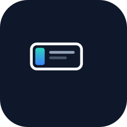
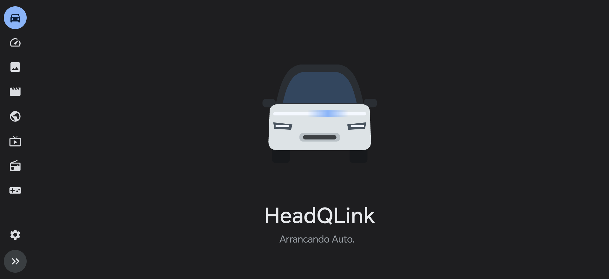

<p align="center">
  
</p>

# HeadQLink

> **Este fork (CharlysEV/headqlink) — rama `main`.** Sobre el HeadQLink original añade:
>
> - **Motor de protocolo QDAuto** ([CharlysEV/qdauto](https://github.com/CharlysEV/qdauto)): implementación propia de
>   QDLink/SSPLink, probada en un C10 real. Es el motor por defecto; el original de headqlink sigue disponible.
> - **Conexión por punto de acceso del móvil**, además de Wi-Fi Direct.
> - **Reconexión sin reiniciar Android Auto**: si el coche corta, la imagen vuelve en décimas de segundo.
> - **Menos calor**: perfil «Coche» (30 fps y el bitrate que pide el coche), pantalla del móvil apagable
>   durante la proyección y adaptación térmica automática.
> - **Comprobación de requisitos** con un botón a cada ajuste, **log exportable** y detector de cortes de radio.
> - **Portugués** (Portugal y Brasil).
> - **Seguridad**: servicios sin exportar, accesibilidad limitada a Android Auto, sin compartir el GPS por defecto.
>
> Detalles técnicos en [docs/qdauto-integration-status.md](docs/qdauto-integration-status.md).

## Manual de usuario

Guía para conductores: instalación, primer arranque, uso en el coche, ajustes, calor y batería, solución de problemas y
cómo exportar el log.

- **Español:** [MANUAL.md](MANUAL.md)
- **Português:** [MANUAL.pt.md](MANUAL.pt.md)
- **English:** [MANUAL.en.md](MANUAL.en.md)
- **Italiano:** [MANUAL.it.md](MANUAL.it.md)


Android app that brings **Android Auto** and a custom side panel with extra features to the
**Leapmotor C10** screen, using the car's built-in mirroring connection (SSPLink over WiFi Direct).
The phone can stay locked with the screen off. No root required.

<p align="center">
  
  <br/>
  <em>Car screen: side panel + Android Auto (shown during startup)</em>
</p>

Personal and experimental project. Fork of [Open Headunit](https://github.com/andreknieriem/open-headunit)
(original README at [README_OPEN_HEADUNIT.md](README_OPEN_HEADUNIT.md)).

## Features

- ✅ **Phone screen off** — once connected, the phone can be locked with the screen off; projection keeps running.
- ✅ **Multitouch** — all touch points from the car's screen are forwarded to Android Auto (up to 3 fingers for pinch-to-zoom in Maps, etc.).
- ✅ **Steering wheel controls via Bluetooth** — media keys (play/pause, next, previous) work through the car's existing HFP/AVRCP Bluetooth connection; no extra pairing needed.
- ✅ **Extended interface** — an optional side panel with extra screens (route planner, efficiency, radio, photos, videos, games and more). **Only intended for use while the vehicle is stationary.**
- 🚧 **Removing the need for accessibility settings.** Currently, with Android Auto 17.4+, the app requires enabling AA's developer mode (a one-time step). Investigating alternative launch paths to eliminate this requirement.
- 🚧 **Performance.** Targeting 30/60 fps with no substantial frame loss.
- 🚧 **In-motion testing.** Tested with drive gear engaged while stationary; more road testing is needed.

## How it works (two modes depending on Android Auto version)

| | Android Auto < 17.4 | Android Auto ≥ 17.4 |
|---|---|---|
| **Launch method** | Direct: the app starts AA's wireless setup activity itself | Developer Head Unit Server on port 5277 |
| **Accessibility service** | Not needed | Required (to start/stop the server) |
| **AA developer mode** | Not needed | Required (one-time setup) |
| **Complexity** | Simple and automatic | Requires initial configuration |

With **AA < 17.4**, HeadQLink launches Android Auto's wireless projection directly — no developer mode, no accessibility service, no exposed network port. This is the ideal path.

With **AA ≥ 17.4**, Google removed the direct launch path. The only viable route is AA's built-in developer head unit server, which requires enabling developer mode once and granting HeadQLink the accessibility permission so it can start and stop the server automatically. The server listens on all network interfaces while active, so HeadQLink shuts it down as soon as the session ends.

## Requirements

- A Leapmotor C10 with the mirroring app on its screen.
- An Android phone with Android Auto installed. Tested on Android 16 with Snapdragon 8 Gen 3;
  other devices may work but are untested.
- For **AA ≥ 17.4**: AA developer mode enabled and the HeadQLink accessibility service active.
- To build from source: JDK 17 and the Android SDK (compileSdk 36). Dependencies (AndroidX, Media3,
  Glide, protobuf…) are downloaded by Gradle.
- Internet for features that use it: OpenStreetMap (Nominatim, Overpass), OSRM, Open-Meteo,
  radio-browser.info and, for chargers in Spain, the DGT's National Access Point (nap.dgt.es). The
  app does not send telemetry.

## Installation

1. Download the APK from the latest **[Release](../../releases)** and install it (Android will ask
   to allow installation from the browser or file manager).
2. Open HeadQLink and follow the setup wizard: permissions and, for AA ≥ 17.4, accessibility service
   and Android Auto developer mode.
3. On the car's screen, open the mirroring app and tap **Connect** on the phone (or enable automatic
   connection via Bluetooth).

## Building from source

Requirements: JDK 17 and the Android SDK (compileSdk 36). Gradle downloads all other dependencies.

```bash
# On macOS with Homebrew OpenJDK:
JAVA_HOME="$(brew --prefix openjdk@17)/libexec/openjdk.jdk/Contents/Home" \
  ./gradlew assembleGithubDebug

# On Linux / Windows (if JDK 17 is the default):
./gradlew assembleGithubDebug
```

The output APK is at `app/build/outputs/apk/github/debug/`. If `key.properties` exists, the APK is
signed with your key; otherwise it uses the default debug key.

## Project structure

```
app/src/main/java/
├── com/andrerinas/openheadunit/   # Open Headunit base (AA protocol, decoder, launcher)
│   ├── aap/                       #   AA Protocol (control, transport, video, navigation)
│   ├── connection/                #   Connection management and self-launchers
│   └── decoder/video/             #   Video decoder and frame relay
└── com/headqlink/link/            # HeadQLink additions
    ├── SspSession.java            #   SSPLink protocol (UDP discovery, TCP session, H.264)
    ├── CarUi.java                 #   Car screen UI (side panel + AA on VirtualDisplay)
    ├── LinkService.java           #   Foreground service managing the connection
    ├── SetupActivity.java         #   Setup wizard (permissions, AA config)
    ├── GlFrameRelay.java          #   OpenGL compositor (AA + panel → SSPLink video)
    ├── RouteTab.java              #   Route planner (OSM / OSRM)
    ├── EfficiencyScreen.java      #   Energy and efficiency display
    ├── RadioScreen.java           #   Internet radio (radio-browser.info)
    └── ...                        #   Games, gallery, IPTV, instruments, etc.
```

## License

[GNU AGPL-3.0](LICENSE). This project incorporates code from
[Open Headunit](https://github.com/andreknieriem/open-headunit) (whose original copyright notices
are preserved, including [Michael Reid's](COPYRIGHT_MICHAEL_REID_GPLv3AFFERO.txt)), but **HeadQLink
is an independent project with no relationship to Open Headunit or its authors.** It is not
endorsed, supported or affiliated with them in any way.

The optional "real car data" feature (Leapmotor account: battery, range, charging, tyre
pressures, doors and odometer in the extended mode) uses a client ported from
[LMB10](https://github.com/txurtxil/LPB10) by **txurtxil** (GPL-3.0), combined here under section 13 of
the GPL-3.0/AGPL-3.0: login, session refresh, request signing, vehicle list and status. It is read-only except
for one opt-in command, sentry mode on/off, sent only if the user saves the car PIN (flow as in
[leapmotor-api](https://github.com/markoceri/leapmotor-api) by **markoceri**, AGPL-3.0); no other remote command exists. See [NOTICE](NOTICE) and the ported files' headers. It talks to Leapmotor's unofficial
API, which may stop working at any time. The range-extender (REEV) tank signals and the per-trip history
fields follow [leapmotor-mate](https://github.com/ProtossBlaster/leapmotor-mate) (ProtossBlaster), and the
weekly consumption endpoint follows [leapmotor-api](https://github.com/markoceri/leapmotor-api) (markoceri),
both AGPL-3.0. The 3D car in the Status tab uses [three.js](https://threejs.org) (MIT, bundled in
`app/src/main/assets/three` with its licence).

This project is not affiliated with, endorsed by or sponsored by Leapmotor, Google, Neusoft, Open
Headunit or any other company or project. Leapmotor, C10, Android Auto and QDLink are trademarks of
their respective owners and are mentioned here only to describe what the app works with.

## Disclaimer: AS IS, NO WARRANTIES

**THIS SOFTWARE IS PROVIDED "AS IS", WITHOUT WARRANTY OF ANY KIND, EXPRESS OR IMPLIED,** including
but not limited to the warranties of merchantability, fitness for a particular purpose, operation,
safety and non-infringement. It is experimental, relies on an undocumented protocol and may fail,
stop working or behave unexpectedly at any time.

**THE AUTHORS AND CONTRIBUTORS ASSUME NO LIABILITY** for any damages, direct or indirect, of any
kind, arising from the use, misuse or inability to use this software, including but not limited to:
accidents, injuries, damage to the vehicle, phone or third parties, data loss, fines or penalties,
loss of vehicle or phone warranty, and violation of third-party terms of service.

By installing or using this software **you accept that you do so at your own risk**. The driver is
solely responsible for complying with traffic laws and driving safely: **do not use the app or watch
videos, games or other content while driving.**

Sections 15 (no warranty) and 16 (limitation of liability) of the [AGPL-3.0 license](LICENSE) also
apply.
